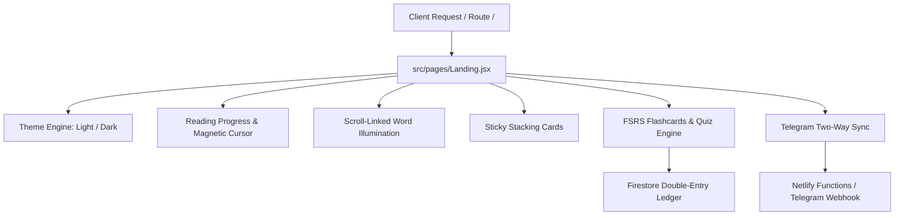

# Black Fighters — Platform & Editorial Landing Page Specification

> **The Cognitive Intelligence Layer for Medicine and Academia**  
> *Official Editorial Architecture, Design System Tokens, and Complete Copy Transcript*

---

## 1. Brand Identity & Design Language

### Core Identity
- **Name:** `Black Fighters` (Display: `Black Fighters.`)
- **Tagline:** The cognitive study layer for medicine and academia
- **Target Audience:** Medical students, clinical residents, fellows, and health-sciences researchers
- **Voice:** Calm, disciplined, authoritative, literary. Short declarative sentences. Zero exclamation marks. Zero emojis in editorial prose. Realistic clinical figures and pricing.

### Typography System
Loaded from Google Fonts with `display=swap`:
1. **Instrument Serif** (`regular` and `italic`):
   - Used for all major headlines, large statements, stats, quotes, prices, and the giant footer wordmark.
2. **Inter Tight** (`400`, `500`, `600`):
   - Used for body prose, explanatory paragraphs, FAQ answers, and feature lists.
3. **JetBrains Mono** (`400`, `500`, uppercase, `letter-spacing: 0.06em`):
   - Used for metadata labels, indices `(01)`, tags, buttons, badges, navigation links, and microcopy.

### Color Tokens & High-Contrast Palettes

| Token | Light Mode | Dark Mode (`[data-theme="dark"]`) | Description |
| :--- | :--- | :--- | :--- |
| `--paper` | `#f3f1ec` | `#0c0c0b` | Base canvas background |
| `--paper-2` | `#e9e6de` | `#151513` | Elevated card surfaces |
| `--ink` | `#0d0d0c` | `#f1efe9` | Primary typography & high-contrast elements |
| `--mute` | `#54524c` | `#9e9c94` | Secondary metadata (passes 4.5:1 contrast) |
| `--line` | `rgba(13,13,12,0.14)` | `rgba(241,239,233,0.16)` | Hairline structural borders (1px) |
| `--signal` | `#ff4d1f` | `#ff6a3d` | Single accent: dots, italics, checks, primary CTA |

### Design Constraints
- **Square Corners Everywhere:** Standard elements use 0px border radius; only interactive pill buttons use rounded caps (`border-radius: 9999px`).
- **Hairlines Over Boxes:** Separation is achieved via 1px hairline rules (`var(--line)`), never drop shadows or gradient cards.
- **Strict Direction:** Document and component level enforced `dir="ltr"` and `lang="en"`.
- **Zero Heavy Layers:** No backdrop blur filters, no WebGL 3D meshes on the landing route, no third-party animation runtimes (pure CSS transforms and requestAnimationFrame).

---

## 2. Complete Section-by-Section Transcript & Architecture

### Section 01: Fixed Site Header
- **Wordmark:** `Black Fighters.` (with `--signal` accent period)
- **Desktop Navigation:**
  - `(01) Capabilities` (`#work`)
  - `(02) Methodology` (`#process`)
  - `(03) Telemetry` (`#numbers`)
  - `(04) Tiers` (`#pricing`)
  - `(05) Inquiries` (`#faq`)
- **Controls:**
  - Primary Action: `Start Free →` (or `Dashboard` if authenticated)
  - Visual Theme Toggle: Mono button toggling `Dark` / `Light`
  - Mobile Menu Trigger: Fullscreen overlay trigger under 900px
- **Behavior:** Fixed top; receives a solid `--paper` background after 24px of scroll; hides on scroll down (`translateY(-100%)`), smoothly returns on scroll up.

---

### Section 02: Hero Section
- **Background Guides:** Four subtle vertical hairline rules dropping down smoothly on initial page load.
- **Meta Tagline Row:**
  ```text
  (01)    THE COGNITIVE STUDY LAYER FOR MEDICINE    EST. 2024
  ```
- **Headline (Instrument Serif):**
  - Line 1: `Compress dense textbooks.`
  - Line 2: `Retain` *`everything.`* (with italic `--signal` accent on *everything*)
- **Lede Copy:**
  > Black Fighters synthesizes 1,000-page clinical references and raw lecture decks into structured, citation-backed intelligence, active-recall quizzes, and synchronized spaced repetition.
- **Call-to-Action Group:**
  - Primary Pill Button: `Start studying free →` (Magnetic micro-interaction)
  - Secondary Text Link: `See the methodology ↓` (Smooth scroll to thesis)
- **Motion:** Headline lines reveal inside overflow-hidden masks (`translateY(110%)` to `0` over 1.2s with `cubic-bezier(.19, 1, .22, 1)`). Headline drifts upward up to 60px linked to scroll.

---

### Section 03: Precision Ticker
- **Structure:** Continuous horizontal scroll track with double-buffered items for a seamless 40s loop. Pauses on user cursor hover.
- **Items Separated by Signal Dots:**
  ```text
  1,000-Page Textbook Engine · Page-Level Citations · Clinical Dosage Verifier · 
  FSRS Spaced Repetition · Telegram Bot Auto-Sync · Prerequisite Bridges · 
  Credit Ledger Protection · Clinical Reasoning Banks
  ```

---

### Section 04: The Thesis (Manifesto)
- **Label:** `(02) THE THESIS`
- **Typography:** Instrument Serif, `clamp(2.1rem, 5.4vw, 5.2rem)`, `line-height: 1.08`.
- **Text:**
  > "Medical students and clinicians do not struggle from a lack of information. They drown in unrefined volume. When every examination demands thousands of complex slides, passive reading is quiet surrender. Black Fighters reconstructs raw syllabi into verifiable, foundational principles, so deep clinical comprehension becomes an *inherent truth.* Every claim cited. Every dosage confirmed."
- **Interaction:** Every word initializes at 14% opacity. As the user scrolls through the section, words progressively illuminate to 100% tied directly to scroll progress.

---

### Section 05: Capabilities Index
- **Header:** `Capabilities` / `Four pillars, one source of truth.`
- **Interactive Grid:** Four hairline-separated rows. On hover, a scaleY background fill inverts the row to `--ink` while text flips to `--paper` and the index highlights in `--signal`:

1. **01 — Textbook & Lecture Synthesis**
   - *Description:* Partition documents up to 1,000 pages into modular chapters with preserved page numbers and locked medical terminology.
   - *Action:* `↗`

2. **02 — Prerequisite Scaffolding**
   - *Description:* The 'Before You Read' protocol explains physiological mechanisms from the ground up before diving into complex pharmacology.
   - *Action:* `↗`

3. **03 — Clinical Active Recall**
   - *Description:* Auto-generate diagnostic case dilemmas, evidence-based reasoning scenarios, and FSRS spaced repetition cards directly from source pages.
   - *Action:* `↗`

4. **04 — Autonomous Telegram Sync**
   - *Description:* Receive formatted briefings, offline high-resolution PDF exports, and interactive revision quizzes directly in your mobile messaging inbox.
   - *Action:* `↗`

---

### Section 06: Methodology (Process Cards)
- **Header:** `Methodology` / `Three steps. Zero cognitive waste.`
- **Behavior:** 3 sticky cards that progressively stack as the user scrolls downwards (`position: sticky`, top offset increases by 26px per card).

- **Card 01: Ingest**
  - *Meta:* `STEP 01` · `INGEST`
  - *Headline:* Upload dense textbooks and slides up to 1,000 pages with *zero* context loss.
  - *Description:* Our OCR and semantic document engine partitions vast medical syllabi into coherent modules while locking core clinical terminology and dosage tables.
  - *Tags:* `1,000-Page Buffer` · `Semantic Chunking`

- **Card 02: Synthesize**
  - *Meta:* `STEP 02` · `SYNTHESIZE`
  - *Headline:* Our medical reasoning model structures every chapter with verifiable citations and *grounded* facts.
  - *Description:* Every physiological mechanism, diagnostic criterion, and drug interaction is linked bi-directionally to its source textbook page.
  - *Tags:* `Page Citations` · `Dosage Verifier`

- **Card 03: Retain**
  - *Meta:* `STEP 03` · `RETAIN`
  - *Headline:* Transition from passive reading into active recall across web and Telegram with *FSRS* algorithms.
  - *Description:* Calculated memory decay intervals schedule your quizzes and flashcards so high-yield clinical facts survive long past exam day.
  - *Tags:* `FSRS Spaced Repetition` · `Telegram Bot Sync`

---

### Section 07: Clinical Telemetry (Numbers)
- **Header:** `Telemetry` / `Proven in academic hospitals.`
- **Animation:** Numerical count-up triggers once on viewport intersection over 1.5s with ease-out interpolation.

| Metric | Target | Label | Verification |
| :--- | :--- | :--- | :--- |
| **1,000** | `1000` | Max pages per single textbook upload | Processed in a single coordinated pipeline |
| **99%** | `99%` | Citation grounding & factual trace accuracy | Direct page-level link to source PDF |
| **14h** | `14h` | Average study hours saved weekly per student | Benchmarked across active medical cohorts |
| **28+** | `28+` | Clinical specialties and subject modules | Anatomy, Physiology, Pharma, Surgery, etc. |

---

### Section 08: Clinical Testimonial
- **Quote (Instrument Serif):**
  > “We replaced five fragmented study tools and pre-exam all-nighters with one structured system. Now our students understand the physiological reasons, not just the slides, and the *evidence* remains verifiable at the bedside.”
- **Attribution (Mono):**
  `Prof. K. Mansour — Clinical Education Fellow & Medical Resident Lead`

---

### Section 09: Subscriptions & Pricing
- **Header:** `Pricing` / `Plain prices. Guaranteed credits.`
- **Billing Switch:** Toggle between `Monthly` and `Annual (25% Savings)`.

#### Tier 1: Starter
- **Price:** `0 EGP / month`
- **Summary:** Essential lecture synthesis and active recall for individual students.
- **Included Capabilities:**
  - ✓ Core lecture & slide summaries
  - ✓ Foundational 'Before You Read' boxes
  - ✓ Daily FSRS flashcard reviews
  - ✓ Standard web reader with dark mode
  - ✓ Community support
- **CTA:** `Start studying free` (Links to `/register`)

#### Tier 2: Pro Fighter (Featured Inverted Tier)
- **Styling:** Inverted `--ink` card background with `--paper` text.
- **Price:** `149 EGP / month` (or `119 EGP / month` annually)
- **Summary:** For clinical students and demanding academic semesters.
- **Included Capabilities:**
  - ✓ **900 monthly AI credits**
  - ✓ **1,000-page textbook engine**
  - ✓ Page-level citations & clinical dosage verifier
  - ✓ Unlimited PDF, HTML, & Telegram export
  - ✓ Two-way Telegram bot synchronization
  - ✓ Clinical reasoning case quizzes
- **CTA:** `Choose Pro Fighter`

#### Tier 3: Supreme Max
- **Price:** `249 EGP / month` (or `199 EGP / month` annually)
- **Summary:** For residents, board candidates, and study group leaders.
- **Included Capabilities:**
  - ✓ **2,500 monthly AI credits**
  - ✓ Priority processing queue with zero wait
  - ✓ Full Telegram Mini App integration
  - ✓ Emergency round clinical simulations
  - ✓ Double-entry ledger credit insurance
  - ✓ Dedicated priority academic support
- **CTA:** `Choose Supreme Max`

---

### Section 10: Inquiries (Medical & System FAQ)
- **Header:** `Questions` / `Asked, answered.`
- **Accordion Mechanism:** Pure CSS grid transition (`grid-template-rows: 0fr` to `1fr`).

1. **How does Black Fighters summarize 1,000-page textbooks without losing critical details?**
   - *Answer:* Large files are partitioned into coordinated chapters with a locked terminology index. Rather than compressing blindly, our architecture preserves every clinical criterion and links each paragraph directly to its source PDF page.

2. **What is the 'Before You Read' foundational bridge?**
   - *Answer:* Before diving into dense clinical manifestations or pharmacodynamics, each chapter opens with an intuitive prerequisite framework. It clarifies the core physiological mechanism in simple language while preserving exact medical terminology.

3. **How does the Telegram bot integrate with my account?**
   - *Answer:* You link your Telegram account with one click. Once a lecture or textbook finishes synthesizing, the bot notifies you, delivers offline PDF documents, and generates interactive quizzes you can solve directly in chat.

4. **Are credits refunded if a document processing task fails?**
   - *Answer:* Yes, completely. All credit transactions use a double-entry ledger. Credits are only reserved when a job begins and are automatically restored to your account if any chapter fails or times out.

5. **Can I export my study materials to PDF and flashcard decks?**
   - *Answer:* Yes. All summaries can be downloaded as print-ready, high-resolution PDFs, standalone HTML documents, or exported directly into active-recall quizzes and FSRS spaced repetition schedules.

---

### Section 11: Final Call to Action
- **Headline:** `Master medicine with absolute clarity.` (with italic `--signal` on *absolute*)
- **Primary Pill Action:** `Start studying with Black Fighters →` (Large 48px padding pill)
- **Microcopy:** `No credit card required · Free credits included · Instant access`

---

### Section 12: Site Footer
- **Newsletter Subscription:**
  - *Title:* `Quarterly clinical briefings`
  - *Subtext:* Selected methodology, research notes, and platform upgrades. No spam.
  - *Input:* Bottom-bordered minimalist academic email field with inline validation.
- **Directory Columns:**
  - **Capabilities:** Textbook Engine, Citation Trace, Clinical Quizzes, FSRS Flashcards, Telegram Bot.
  - **Disciplines:** Internal Medicine, Pharmacology, General Surgery, Physiology, Pathology.
  - **Platform:** System Status, Credit Ledger, Emergency Round, Privacy Policy, Terms of Service.
  - **Direct Access:** "Black Fighters organizes your medical curriculum into one quiet, verifiable intelligence surface."
- **Full-Width Giant Wordmark:**
  - Sized at `clamp(3.2rem, 24vw, 24rem)`.
  - Content: `Black Fighters.`
  - Reveals with an upward transition (`translateY(105%)` to `0`) as the footer enters viewport.
- **Copyright:** `© 2026 Black Fighters · All rights reserved`

---

## 3. Platform Architecture & Technical Implementation



### Key Modules & Files
- **Landing Component:** [`src/pages/Landing.jsx`](file:///Users/ibrahimkandil/Desktop/peak-task-flow-local/src/pages/Landing.jsx)
- **Legacy Fallback:** [`src/pages/LandingLegacy.jsx`](file:///Users/ibrahimkandil/Desktop/peak-task-flow-local/src/pages/LandingLegacy.jsx)
- **Standalone Static Mirror:** [`public/black-fighters.html`](file:///Users/ibrahimkandil/Desktop/peak-task-flow-local/public/black-fighters.html) & [`public/meridian.html`](file:///Users/ibrahimkandil/Desktop/peak-task-flow-local/public/meridian.html)
- **Test Suite:** 179/179 Passing contracts covering Motion, Font Budget, Security Rules, and Telegram API.
- **Dev Server:** Vite running at `http://127.0.0.1:5173/`.
